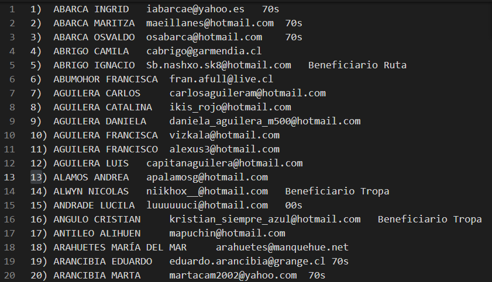
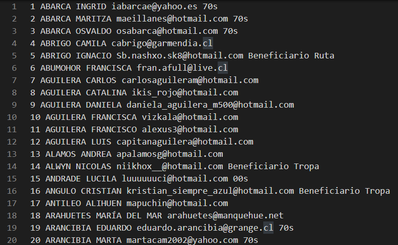
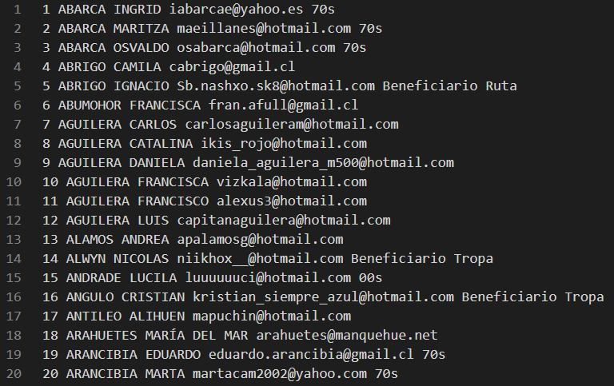
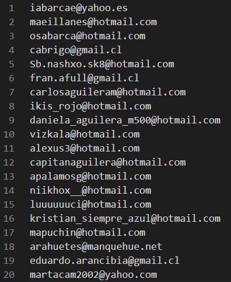
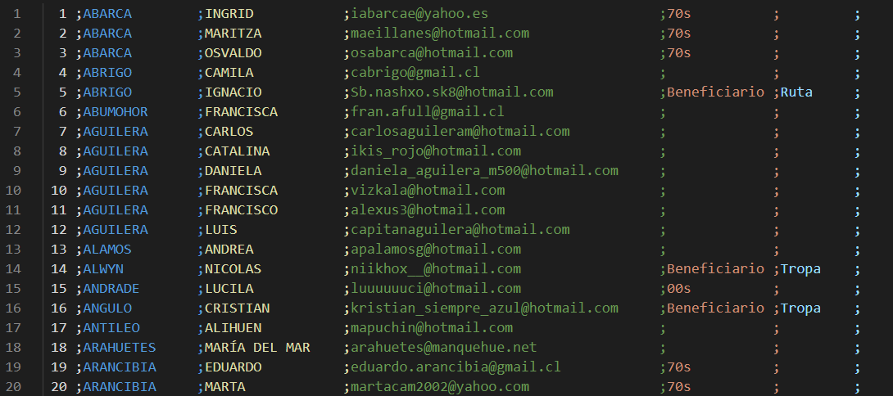
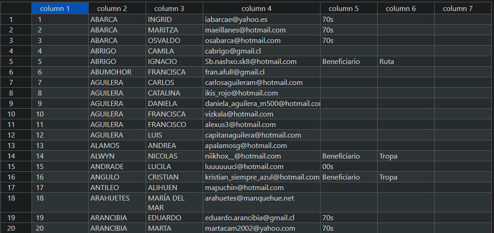

# Ejercicios-Regexp

### Ejercicio 1

Sustituyo los dígitos iniciales por ellos mismos seguidos de un ):  
Buscar: `(^\d+)`  
Reemplazar: `$1)`

### Ejercicio 2

Sustituyo los espacios múltiples y tabuladores por un solo espacio (con los espacios simples también se realiza el cambio aunque no se aprecie, pero es más sencillo ponerlo así que comprobar que haya más de un espacio seguido):  
Buscar: `\s+`  
Reemplazar: *se pone un espacio* ` `

Sustituyo los espacios finales por un campo vacío, por lo que quedan eliminados:  
Buscar: `\s$`  
Reemplazaar: *se deja vacío*

### Ejercicio 3

Sustituyo los correos que contengan @ terminando en .cl o .ch por gmail.cl o gmail.ch:  
Buscar: `(@)\w+(\.c[hl])`  
Reemplazar: `$1gmail$2`

### Ejercicio 4

Aislo el correo con la ayuda de perezosos al inicio y al final para poder eliminar el resto:  
Buscar: `(.*?)((\w*\.*-*){1,}@\w*\.\w*)(.*?$)`  
Reemplazar: `$2`

### Ejercicio 5

En primer lugar coloco un ; al final de cada línea:  
Buscar: `(\n)`  
Reemplazar: `;$1`

A continuación sustituyo todos los espacios entre palabras por ;:  
Buscar: `\s`  
Reemplazar: `;`

Como hay líneas que tienen más campos que otras, necesito igualarlas todas. Esto lo consigo en varios pasos:  
En primer lugar añado un ; a los que tienen como último campo dos números y una s o S:  
Buscar: `(\d.[sS];$)`  
Reemplazar: `$1;`

En segundo lugar busco los que terminan en un correo y le añado dos ;:  
Buscar: `((\w*\.*-*){1,}@\w*\.\w*;$)`  
Reemplazar: `$1;;`

En tercer lugar busco los que terminan como Divergente y les añado un ; más:  
Buscar: `(Dirigente;$)`  
Reemplazar: `$1;`

Por último quedan algunos que necesitan modificarse a mano. Para hacer la tarea más sencilla he realizado una búsqueda de `(.*?;){4,}((\w*\.*-*){1,}@)(.*?$)` para señalar las filas que contienen nombres compuestos e identificarlas más rápidamente y así poder igualar el número de campos en todas las filas.

Finalmente, queda lo siguiente:

